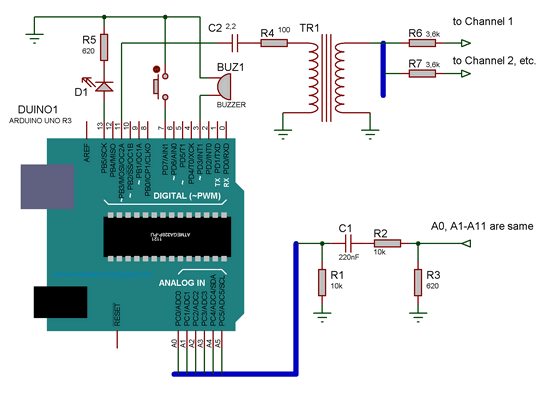
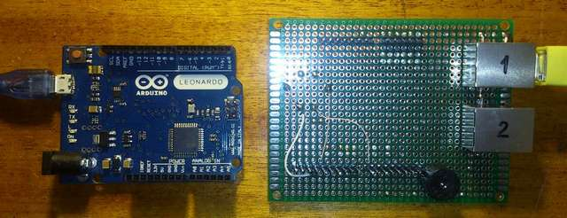
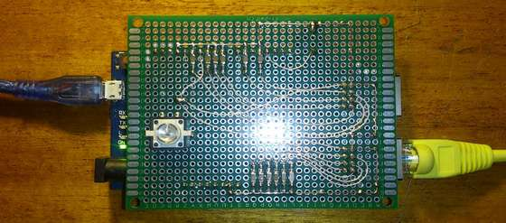
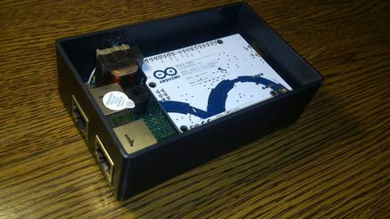
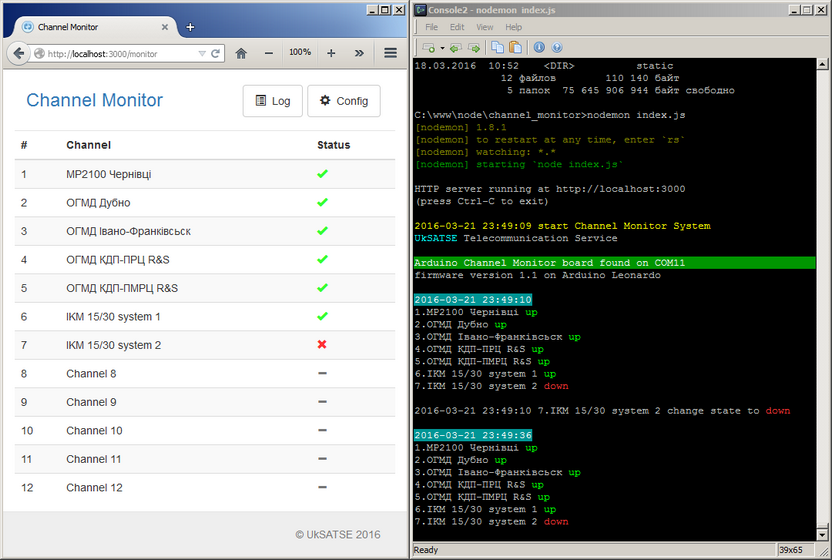

# Channel Monitor

System designed for monitoring channel-forming equipment in realtime and consists of:
  - Arduino Leonardo Board
  - Interface module, number of scanned channels - 12.
  - Web Server ([node.js](https://nodejs.org), [SerialPort lib](https://github.com/voodootikigod/node-serialport), responder based on [Multi App Server](https://github.com/andy-pro/MultiAppServer))
  - [Web2spa](https://github.com/andy-pro/web2spa) - single-page application adapter
  - kilometer of wires

The principle of operation is based on the control signal return

***
  
***
  
*Fig.1. Schematic diagram (not Leonardo, but pin compatible)*  
***
  
*Fig.2. Arduino Leonardo board and Interface module*  
***
  
*Fig.3. Coupling*  
***
  
*Fig.4. Assembled device*  
***

### Version

1.1.0

***

### Installation & run

>upload scetch to Arduino board  
adjust config.json to your needs  
```> npm install```  
```> node index.js  ```  
open localhost:3000/monitor in browser  

### Commands

Use Hyper Terminal like sowtware for testing board with parameters 115200, 8N1.
```
help
Commands:
        help - this help
        ver - firmware version
        state - human readable output
        getstate - server request output
        setmask mask - set mask on scanned channels
        tm pin xx [xx xx xx xx] - task manager pattern E D N P K
        tms index - task manager state for given record
        alm - test alarm
        tone [frequency] - set frequency and tone turn on, 800Hz default
        notone - tone turn off        
```

```
state
Frequency set to 800Hz
Alarm! Channel: 5
Channel Conn    Pin     State   Mask    Frequency
1       X1/3    A5      1       0       80
2       X1/5    A4      1       0       79
3       X1/7    A3      1       0       79
4       X1/8    A2      1       0       79
5       X1/6    A1      0       0       65
6       X1/4    A0      1       0       80
7       X2/4    A6      0       1       0
8       X2/3    A7      0       1       0
9       X2/6    A8      0       1       0
10      X2/8    A9      0       1       0
11      X2/7    A10     0       1       0
12      X2/5    A11     0       1       0
```
```
getstate
query?raw=3904&mask=63
```
```
setmask mask
mask - decimal, 1 ch - MSB, ..., 12 ch - LSB
0 - enable channel
1 - disable channel
```
```
tm
for details see the comments in the file "tm.h"
Examples:
    tm 03 01 09 00 00 -1 - LED flashing once per second is infinitely
    tm 13 0 - turn off buzzer
```
```
tms 1
Task manager state for pin 3
variable pattern
0       3       4       30      -1
constant pattern
1       4       4       30      -1
0       0       0       0       0
0       0       0       0       0
0       0       0       0       0
```

***
  
*Fig.5. Web Server & application CLI*  
***

###API:
```
  monitor/api/monitor
  monitor/api/query?command=[help,ver,state,getstate,setmask,tm,tms,alm,tone,notone]
  monitor/api/getstate
  monitor/api/getlog
  monitor/api/clearlog
  monitor/api/lexicon
  monitor/api/restart
```

***

**UkSATSE 2016**
