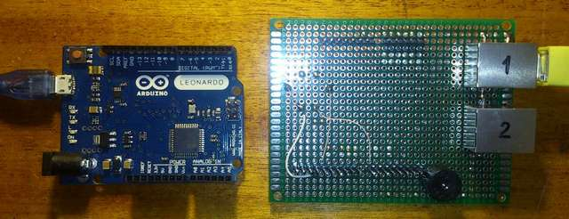
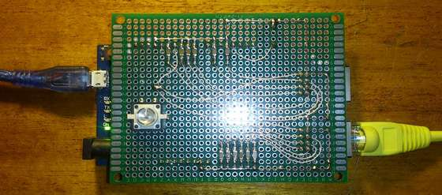

# Channel Monitor

System designed for monitoring channel-forming equipment in realtime and consists of:
  - Arduino Leonardo Board
  - Interface module
  - Web Server (node.js, Express, Serial lib)
  - kilometer of wires

> Maximum of scanned channels - 12.

***
  
*Fig.1 Arduino Leonardo board and Interface module*  
***
  
*Fig.2 Assembled device*  
***

### Version

1.1

### Commands

Use Hyper Terminal like sowtware for testing board with parameters 115200, 8N1.
```
help
Commands:
        help - this help
        ver - firmware version
        state - human readable output
        getstate - server request output
        setmask mask - set mask on scanned channels, decimal, 1 ch - MSB, ..., 12 ch - LSB
        tm pin xx [xx xx xx xx] - task manager pattern E D N P K
        tms index - task manager state for given record
        alm - test alarm
        tone [frequency] - set frequency and tone turn on, 800Hz default
        notone - tone turn off        
```

```
ver
firmware version 1.1 on Arduino Leonardo
```
```
state
Frequency set to 800Hz
Alarm! Channel: 5
Channel Conn    Pin     State   Mask    Frequency
1       X1/3    A5      1       0       80
2       X1/5    A4      1       0       79
3       X1/7    A3      1       0       79
4       X1/8    A2      1       0       79
5       X1/6    A1      0       0       65
6       X1/4    A0      1       0       80
7       X2/4    A6      0       1       0
8       X2/3    A7      0       1       0
9       X2/6    A8      0       1       0
10      X2/8    A9      0       1       0
11      X2/7    A10     0       1       0
12      X2/5    A11     0       1       0
```
```
getstate
query?raw=3904&mask=63
```
```
tm
for details see the comments in the file "tm.h"
Examples:
    tm 03 01 09 00 00 -1 - LED flashing once per second is infinitely
    tm 13 0 - turn off buzzer
```
```
tms 1
Task manager state for pin 3
variable pattern
0       3       4       30      -1
constant pattern
1       4       4       30      -1
0       0       0       0       0
0       0       0       0       0
0       0       0       0       0
```
```
tone 1000
```
```
notone
```

***

**UkSATSE 2016**
